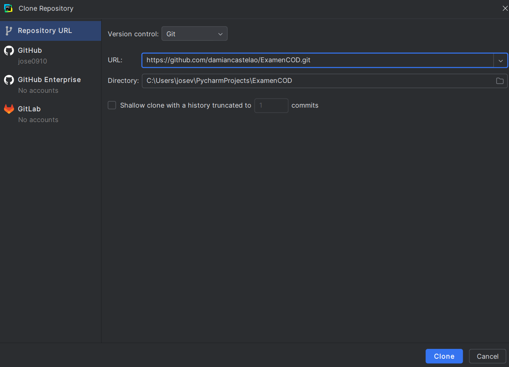
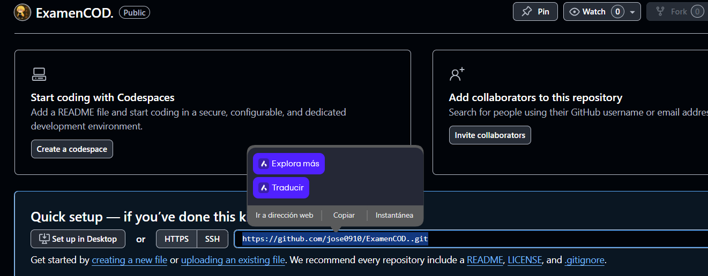
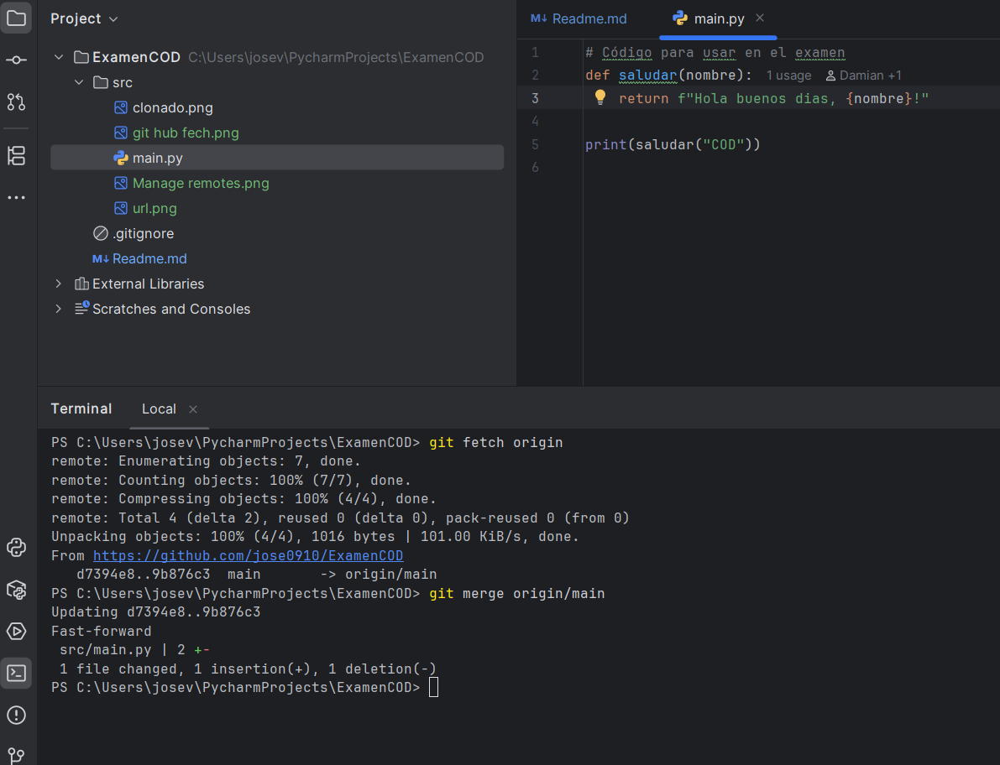

# Examen 1ª Evaluación (2ª Parte) - Control de Versiones

---

### Apartado 1

- Clona este repositorio.
- Modifica este Readme, poniendo tu nombre completo, realiza un `commit` con el mensaje *"Apartado 1"* y un `push`.
- Jose Manuel Vazquez Alonso

Pregunta 
- ¿Qué paso es fundamental cuando clonamos un repositorio ajeno para que podamos subir nuestros propios commits? Explícalo y utiliza capturas de pantalla.
- Crear un nuevo repositorio en git hub y poniendo la url en manage remotes para que cada vez que
hagamos un commit y lo pusheemos se nos suba a nuestro repositorio anteriormente creado
- 
- 

### Apartado 2

- Realiza una modificación en el código en la web de tu repositorio en GitHub
- Utiliza fetch para descargar los cambios realizados en tu repositorio.

Pregunta
- Explica los pasos para que el código modificado en GitHub, llegue a tu rama principal local. Explícalo con capturas de pantalla.
- Entramos en nuestro repositorio de git hub, buscamos la carpeta de src y le damos a la opcion de editar (tiene el icono de un boli)
- 
- Le damos a commit changes y luego nos vamos a la consola de pycharm y ponemos lo siguiente
- 
### Apartado 3

- Realiza otro cambio desde la web de tu repositorio en GitHub.
- Utiliza pull para descargar los cambios realizados en tu repositorio.

Pregunta
- Explica los pasos dados para que el cambio realizado en GitHub, llegue a tu rama principal local. Explícalo con capturas de pantalla.

